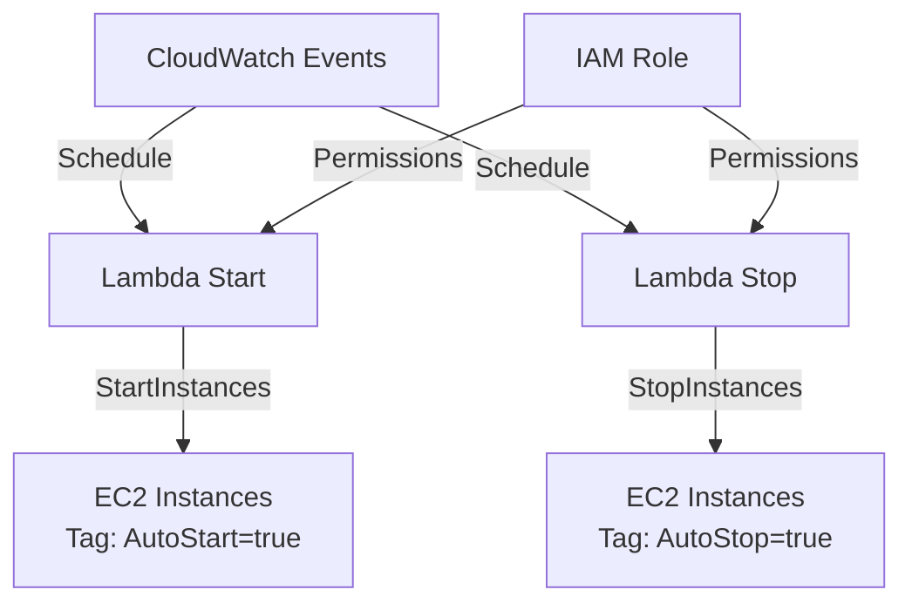

# 🚀 AWS EC2 Auto Start/Stop avec Lambda

[](https://terraform.io/)
[](https://aws.amazon.com/)
[](https://python.org/)

> **Solution serverless pour automatiser le démarrage et l'arrêt des instances EC2 AWS, permettant d'économiser jusqu'à 50% des coûts d'infrastructure.**

## 📋 Table des matières

- [🎯 Vue d'ensemble](#-vue-densemble)
- [💰 Bénéfices](#-bénéfices)
- [🏗️ Architecture](#️-architecture)
- [⚡ Fonctionnalités](#-fonctionnalités)
- [🚀 Installation](#-installation)
- [🔧 Configuration](#-configuration)
- [📊 Utilisation](#-utilisation)
- [📁 Structure du projet](#-structure-du-projet)
- [🔒 Sécurité](#-sécurité)
- [📈 Monitoring](#-monitoring)
- [🤝 Contribution](#-contribution)
- [📄 Licence](#-licence)

## 🎯 Vue d'ensemble

Ce projet Terraform déploie une solution complète d'automatisation EC2 utilisant AWS Lambda pour :

- **Démarrer automatiquement** les instances EC2 taguées `AutoStart=true`
- **Arrêter automatiquement** les instances EC2 taguées `AutoStop=true`
- **Programmer** ces actions via CloudWatch Events
- **Économiser** significativement sur les coûts AWS

### 🎯 Cas d'usage

- **Environnements de développement** : Arrêt automatique le soir, démarrage le matin
- **Environnements de test** : Utilisation uniquement pendant les heures de travail
- **Sandboxes** : Éviter les instances oubliées qui tournent 24/7
- **Conformité** : Respect des politiques d'entreprise sur l'utilisation des ressources

## 💰 Bénéfices

### 💵 Économies financières
- **Réduction des coûts** : Jusqu'à 50% d'économies sur les instances EC2
- **Exemple concret** : Instance t3.medium (~50€/mois) arrêtée 12h/jour = **25€ économisés par mois**
- **ROI immédiat** : Coût Lambda (~0.20€/million d'exécutions) vs économies potentielles

### ⚡ Efficacité opérationnelle
- **Automatisation complète** : Plus besoin d'intervention manuelle
- **Réduction des erreurs** : Élimination des oublis d'arrêt d'instances
- **Focus sur la valeur** : L'équipe se concentre sur le développement

## 🏗️ Architecture



### 🔧 Composants

- **AWS Lambda Functions** : Code Python pour démarrer/arrêter les instances
- **IAM Role & Policies** : Permissions sécurisées pour EC2
- **CloudWatch Events** : Planification des exécutions
- **Terraform** : Infrastructure as Code
- **S3 Backend** : Stockage du state Terraform

## ⚡ Fonctionnalités

### ✅ Fonctionnalités implémentées

- [x] **Deux fonctions Lambda** (start/stop) avec code Python réutilisable
- [x] **Rôle IAM sécurisé** avec permissions minimales nécessaires
- [x] **Variables d'environnement** pour différencier les actions
- [x] **Architecture modulaire** avec fichiers Terraform séparés
- [x] **Backend S3** pour la gestion du state
- [x] **Règle CloudWatch** pour la planification

### 🚧 En cours de développement

- [ ] **Configuration complète du provider** AWS
- [ ] **Instances EC2 de test** avec tags appropriés
- [ ] **Targets CloudWatch** pour déclencher les Lambda
- [ ] **Outputs Terraform** pour afficher les ressources créées
- [ ] **Monitoring et alertes** CloudWatch

## 🚀 Installation

### Prérequis

- [Terraform](https://terraform.io/downloads.html) >= 1.0
- [AWS CLI](https://aws.amazon.com/cli/) configuré
- Compte AWS avec permissions appropriées
- Bucket S3 pour le backend Terraform

### 1. Cloner le projet

```bash
git clone https://github.com/FranckJudes/learn-terraform-get-started-aws.git
cd learn-terraform-get-started-aws
```

### 2. Configurer AWS

```bash
aws configure
# Entrez vos credentials AWS
```

### 3. Configurer le backend S3

Éditez `backend.tf` :

```hcl
terraform { 
    backend "s3" {
        bucket = "votre-bucket-terraform-state"
        key    = "ec2-auto-start-stop/terraform.tfstate"
        region = "eu-west-1"
    }
}
```

### 4. Initialiser Terraform

```bash
terraform init
```

## 🔧 Configuration

### Variables d'environnement

Le projet utilise les variables suivantes :

| Variable | Description | Valeur par défaut |
|----------|-------------|-------------------|
| `ACTION` | Action à exécuter (start/stop) | Définie dans chaque Lambda |
| `REGION` | Région AWS | `eu-west-1` |

### Tags EC2 requis

Pour que les instances soient gérées automatiquement, elles doivent avoir les tags suivants :

```bash
# Pour l'arrêt automatique
AutoStop=true

# Pour le démarrage automatique  
AutoStart=true
```

### Exemple de création d'instance avec tags

```bash
aws ec2 run-instances \
    --image-id ami-0c02fb55956c7d316 \
    --instance-type t3.micro \
    --tag-specifications 'ResourceType=instance,Tags=[{Key=AutoStop,Value=true},{Key=AutoStart,Value=true}]'
```

## 📊 Utilisation

### Déploiement

```bash
# Planifier les changements
terraform plan

# Appliquer la configuration
terraform apply
```

### Test manuel des fonctions Lambda

```bash
# Tester la fonction d'arrêt
aws lambda invoke \
    --function-name stop-instance \
    --payload '{}' \
    response.json

# Tester la fonction de démarrage
aws lambda invoke \
    --function-name start-instance \
    --payload '{}' \
    response.json
```

### Vérification des logs

```bash
# Voir les logs de la fonction stop
aws logs describe-log-groups --log-group-name-prefix /aws/lambda/stop-instance

# Voir les logs de la fonction start
aws logs describe-log-groups --log-group-name-prefix /aws/lambda/start-instance
```

## 📁 Structure du projet

```
learn-terraform-get-started-aws/
├── 📄 README.md                 # Documentation du projet
├── 🔧 terraform.tf             # Configuration Terraform
├── 🌐 provider.tf              # Configuration provider AWS
├── 🏗️ backend.tf              # Backend S3 pour le state
├── 📦 01_lambda.tf             # Définition des fonctions Lambda
├── 🔐 02_lambda_role.tf        # Rôle IAM et permissions
├── ⏰ schedule.tf               # Règles CloudWatch Events
├── 🖥️ ec2.tf                   # Instances EC2 (à compléter)
├── 📋 main.tf                  # Configuration principale (à compléter)
└── 📁 code/
    └── 🐍 main.py              # Code Python des fonctions Lambda
```

### Description des fichiers

- **`terraform.tf`** : Configuration des providers Terraform
- **`provider.tf`** : Configuration du provider AWS
- **`backend.tf`** : Configuration du backend S3 pour le state
- **`01_lambda.tf`** : Définition des deux fonctions Lambda (start/stop)
- **`02_lambda_role.tf`** : Rôle IAM avec permissions EC2
- **`schedule.tf`** : Règles CloudWatch pour la planification
- **`code/main.py`** : Code Python réutilisable pour les deux fonctions
- **`ec2.tf`** : Définition des instances EC2 (à compléter)
- **`main.tf`** : Configuration principale (à compléter)

## 🔒 Sécurité

### Permissions IAM

Le projet utilise le principe du **moindre privilège** :

```json
{
    "Version": "2012-10-17",
    "Statement": [
        {
            "Effect": "Allow",
            "Action": [
                "ec2:StartInstances",
                "ec2:StopInstances", 
                "ec2:DescribeInstances"
            ],
            "Resource": "*"
        }
    ]
}
```

### Bonnes pratiques

- ✅ **Permissions minimales** : Seulement les actions EC2 nécessaires
- ✅ **Ressources spécifiques** : Possibilité de limiter aux instances taguées
- ✅ **Variables d'environnement** : Configuration sécurisée
- ✅ **State remote** : Stockage sécurisé dans S3

## 📈 Monitoring

### CloudWatch Logs

Les fonctions Lambda génèrent automatiquement des logs dans CloudWatch :

- **Log Group** : `/aws/lambda/stop-instance`
- **Log Group** : `/aws/lambda/start-instance`

### Métriques importantes

- **Invocations** : Nombre d'exécutions
- **Erreurs** : Taux d'échec
- **Durée** : Temps d'exécution
- **Coût** : Estimation des coûts Lambda

### Alertes recommandées

```bash
# Créer une alerte pour les erreurs Lambda
aws cloudwatch put-metric-alarm \
    --alarm-name "Lambda-Errors" \
    --alarm-description "Alert on Lambda function errors" \
    --metric-name Errors \
    --namespace AWS/Lambda \
    --statistic Sum \
    --period 300 \
    --threshold 1 \
    --comparison-operator GreaterThanOrEqualToThreshold
```

## 🛠️ Développement


# Test d'intégration Terraform
```
terraform plan
terraform apply
```

## 🤝 Contribution

Les contributions sont les bienvenues ! Voici comment contribuer :

1. **Fork** le projet
2. **Créer** une branche feature (`git checkout -b feature/AmazingFeature`)
3. **Commit** vos changements (`git commit -m 'Add some AmazingFeature'`)
4. **Push** vers la branche (`git push origin feature/AmazingFeature`)
5. **Ouvrir** une Pull Request

### Guidelines

- Suivre les conventions de nommage Terraform
- Ajouter des tests pour les nouvelles fonctionnalités
- Documenter les changements dans le README
- Respecter les bonnes pratiques AWS

## 📄 Licence

Ce projet est sous licence MIT. Voir le fichier `LICENSE` pour plus de détails.

## 📞 Support

- **Issues** : [GitHub Issues](https://github.com/FranckJudes/learn-terraform-get-started-aws/issues)
- **Discussions** : [GitHub Discussions](https://github.com/votre-username/learn-terraform-get-started-aws/discussions)
- **Email** : votre-email@example.com

---

<div align="center">

**⭐ N'hésitez pas à donner une étoile si ce projet vous a aidé !**

Made with ❤️ by [Franck Judes](https://github.com/FranckJudes)

</div>
